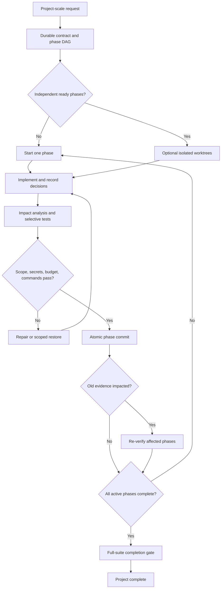

# Keep Coding

Keep Coding turns one large software-project prompt into a durable, evidence-gated implementation loop. Version 0.2 keeps one default workflow—no user-facing modes—while adding adaptive plans, Git checkpoints, semantic impact analysis, approvals, budgets, isolated worktrees, and cross-runtime continuity.

It supports three surfaces:

- **Codex plugin:** skill, lifecycle hooks, local stdio MCP server, and automatic context restoration.
- **ChatGPT custom app:** opt-in remote MCP endpoint with bounded repository tools for normal ChatGPT chats.
- **Other coding runtimes:** a Claude-style hook adapter and generic polling CLI over the same durable state.

Every surface uses the same repository-scoped SQLite ledger and the same completion invariant: a phase is not complete until scope, secret scanning, budgets, deterministic checks, and any configured blocking critic pass.

## Why it exists

Long agent runs drift. Requirements disappear, phase boundaries blur, failed approaches repeat, regressions invalidate old evidence, and “done” becomes a narrative claim. Keep Coding stores the contract outside the chat, versions plan changes, records decisions and failures, and advances work only from machine-readable evidence.

## Default workflow



## Requirements

- Node.js 22.13 or newer
- Git repository for every target project
- Codex with plugin support for the Codex surface
- An eligible ChatGPT workspace and remotely reachable MCP endpoint for normal ChatGPT

## Install for Codex

```bash
npm ci
npm run check
```

In Codex CLI, open `/plugins`, add this repository as a marketplace, install **Keep Coding**, review and trust its hooks, then start a new session. The production bundle is generated at `plugins/keep-coding/dist/keep-coding.mjs`.

## Use in normal ChatGPT chats

Run the opt-in Streamable HTTP MCP server:

```bash
export KEEP_CODING_ALLOWED_ROOTS="/home/me/projects"
export KEEP_CODING_ALLOWED_COMMANDS_JSON='["npm run check","npm test","git diff --check"]'
node plugins/keep-coding/dist/keep-coding.mjs mcp-http
```

Connect the remote `/mcp` endpoint as a custom ChatGPT app. A local stdio server cannot be connected directly; use Secure MCP Tunnel for a developer machine/private network or deploy behind HTTPS and production authentication. See [docs/CHATGPT_APP.md](docs/CHATGPT_APP.md).

## Use

Open a Git repository and state the outcome directly:

> Build this production-ready project end to end from the specification. Include the architecture, implementation, tests, documentation, and release configuration.

Keep Coding uses an explainable confidence score for automatic activation. Force local activation with `KEEP_CODING_ACTIVATE=1` or disable it with `KEEP_CODING_DISABLE=1`.

Durable project state is written to `.keep-coding/state.db`. Add `.keep-coding/` to the target project's `.gitignore`; Keep Coding excludes it from verification and indexing.

## What changed in 0.2

- **Adaptive re-planning:** `amend_plan` adds or supersedes unstarted phases while preserving completed evidence and plan-version history.
- **Git-native checkpoints:** passing phases create commits; failed phases can restore only their declared scope.
- **Parallel preparation:** independent ready phases can receive isolated Git worktrees for concurrent agents.
- **Semantic impact graph:** JavaScript/TypeScript compiler AST plus parser adapters produce import, symbol, call, reference, test, and phase relationships.
- **Impact-aware re-verification:** later changes can move earlier completed phases to `NEEDS_REVERIFICATION`.
- **Dual verification:** deterministic gates remain authoritative; an external critic can be advisory or explicitly blocking.
- **Always-on invariants:** secret scanning and configured budgets cannot be omitted by the plan author.
- **Human approvals:** subjective or authority-bound work pauses in `AWAITING_APPROVAL` without a continuation loop.
- **Selective tests:** impacted tests run during a phase; the inferred full suite runs at `complete_project`.
- **Opt-in playbook:** reusable phase templates and failure fingerprints compound across projects only when `KEEP_CODING_PLAYBOOK=1`.
- **Local dashboard:** `keep-coding dashboard <repo>` exposes a loopback-only, read-only phase/evidence/event view.
- **Runtime adapters:** Codex, Claude-style hooks, and generic polling share one state model.
- **GitHub integration:** CI verifies Node 22/24 and the CLI can generate a PR description from durable decisions and checkpoints.

## MCP tools

### Planning and lifecycle

| Tool | Purpose |
|---|---|
| `initialize_project` | Create the ledger and semantic repository index. |
| `save_plan` | Store the initial contract and acyclic phase DAG. |
| `amend_plan` | Version plan additions and supersessions after work begins. |
| `get_context` | Compile bounded current context. |
| `start_phase` | Start one ready phase or request its declared approval. |
| `checkpoint_phase` | Run invariants and checks, then commit passing phase changes. |
| `restore_phase` | Restore only a failed phase's captured scope baseline. |
| `complete_project` | Run the full-suite gate and complete only verified work. |

### Memory, impact, and control

| Tool | Purpose |
|---|---|
| `record_decision` | Preserve architectural/product rationale. |
| `record_failure` | Deduplicate failed approaches and optionally feed the playbook. |
| `get_impact` | Compute an explainable transitive blast radius. |
| `request_approval` / `resolve_approval` | Model an explicit human decision gate. |
| `suggest_phases` | Consult opt-in reusable phase/failure memory. |
| `prepare_parallel_phases` | Create isolated worktrees for independent ready scopes. |
| `merge_parallel_phase` / `discard_parallel_phase` | Explicitly resolve a prepared worktree. |
| `get_status` | Read the complete durable snapshot. |

### Remote workspace

| Tool | Purpose |
|---|---|
| `list_files` | List bounded repository paths. |
| `read_file` | Read a bounded line range from a text file. |
| `search_code` | Search bounded repository text. |
| `get_diff` | Inspect the current bounded Git diff. |
| `apply_patch` | Apply a unified patch only inside an active phase's allowed scope. |

All tools require an explicit absolute `project_root`. HTTP mode canonicalizes it against `KEEP_CODING_ALLOWED_ROOTS`. Remote plans and checkpoints accept only exact commands listed by the server operator.

## Optional configuration

```bash
# Cross-project templates and failure fingerprints
export KEEP_CODING_PLAYBOOK=1

# Independent critic process; stdin receives JSON and stdout must return JSON
export KEEP_CODING_CRITIC_COMMAND_JSON='["node","./critic.mjs"]'

# Fixed local dashboard port (default: ephemeral)
export KEEP_CODING_DASHBOARD_PORT=4317
```

A critic result is advisory unless the project contract sets `criticGate: "blocking"`.

## CLI

```bash
keep-coding status /path/to/repo
keep-coding context /path/to/repo
keep-coding index /path/to/repo
keep-coding poll /path/to/repo
keep-coding dashboard /path/to/repo
keep-coding pr-description /path/to/repo
```

## Evaluate it statistically

Copy `examples/keep-coding.eval.example.json`, keep everything except plugin availability identical, then run:

```bash
node plugins/keep-coding/dist/keep-coding.mjs eval ./keep-coding.eval.json
```

The evaluator creates paired detached worktrees and writes `raw.jsonl`, `summary.json`, and `summary.md` with success rates, Wilson 95% intervals, paired delta, and exact McNemar p-value. See [docs/EVALUATION.md](docs/EVALUATION.md).

## Development

```bash
npm ci
npm run check
```

The pipeline runs ESLint, strict TypeScript, tests with coverage gates, a production bundle, and plugin structure validation. See [docs/ARCHITECTURE.md](docs/ARCHITECTURE.md), [SECURITY.md](SECURITY.md), and [docs/README.tr.md](docs/README.tr.md).

## Current parser scope

JavaScript and TypeScript use the TypeScript compiler AST. Python uses a structural parser behind the same adapter interface. Other languages currently receive file-level indexing. This is substantially stronger than the v0.1 regex graph but is not presented as full language-server equivalence.

## License

MIT
