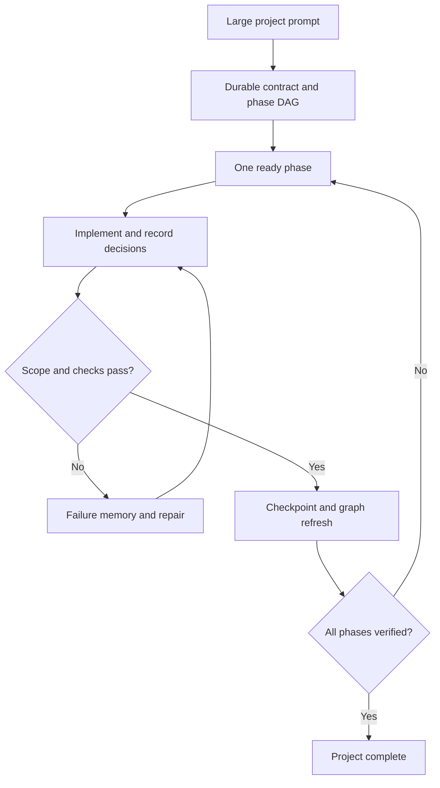

# Keep Coding

Keep Coding is a Codex plugin that turns one large project prompt into a durable, evidence-gated implementation loop. It has one default workflow—no modes to choose and no dashboard to maintain.

It combines:

- a Codex skill that defines the operating protocol;
- lifecycle hooks that activate on project-scale prompts, restore state after compaction, and prevent premature stops;
- a local MCP server with tools for contracts, phases, decisions, failures, checkpoints, and status;
- a SQLite project ledger plus a lightweight file/symbol/import graph;
- a paired A/B evaluator for comparing the same prompt with and without Keep Coding.

## Why it exists

Long agent runs often fail through drift rather than one obvious coding error: requirements disappear from working context, phase boundaries blur, failed approaches repeat, and “done” becomes a narrative claim. Keep Coding stores the contract outside the chat and only advances a phase when its allowed file scope and acceptance commands pass.

## Default workflow



The detector only auto-activates new state for project-scale prompts. Once `.keep-coding/state.db` exists, hooks restore the active contract and phase in every relevant session or context compaction.

## Requirements

- Codex surface with plugin support (Codex CLI or Codex/Work in the ChatGPT desktop app)
- Node.js 22.13 or newer
- Git repository for the target project

## Install from this repository

Build the committed source if you are developing the plugin:

```bash
npm ci
npm run check
```

In Codex CLI, open `/plugins`, add this repository as a marketplace, install **Keep Coding**, review and trust its hooks, then start a new session. Graphical Codex/Work surfaces can install it from the same configured marketplace. See the current [official plugin guide](https://developers.openai.com/codex/plugins).

The distributable already contains `plugins/keep-coding/dist/keep-coding.mjs`; consumers do not need this repository's `node_modules`.

## Use

After installation, open a Git repository and give Codex the outcome directly:

> Build this production-ready project end to end from the specification. Include the architecture, implementation, tests, documentation, and release configuration.

Keep Coding activates automatically when the request crosses its project-scale threshold. To force explicit selection in a supported UI, invoke `@Keep Coding` or its bundled skill. There are no mode flags.

Durable state is written inside the target repository at `.keep-coding/state.db`. Add `.keep-coding/` to the target project's `.gitignore`; the plugin excludes it from verification and indexing automatically.

## MCP tools

| Tool | Purpose |
|---|---|
| `initialize_project` | Create the ledger and index the repository |
| `save_plan` | Store the project contract and acyclic phase graph |
| `get_context` | Compile bounded, current model context |
| `start_phase` | Start one dependency-ready phase |
| `record_decision` | Preserve architectural/product rationale |
| `record_failure` | Deduplicate failed approaches |
| `checkpoint_phase` | Enforce scope and run acceptance commands |
| `get_status` | Read the durable snapshot |
| `complete_project` | Complete only after every phase passes |

All tools require an explicit `project_root`, preventing state from leaking between repositories.

## Evaluate it statistically

Copy `examples/keep-coding.eval.example.json`, point both commands at your Codex runner, and keep everything except plugin availability identical. Then run:

```bash
node plugins/keep-coding/dist/keep-coding.mjs eval ./keep-coding.eval.json
```

The evaluator creates clean detached worktrees from the same commit for each paired run, pipes the same prompt, runs independent verifier commands, and writes:

- `raw.jsonl` — per-run evidence;
- `summary.json` — machine-readable paired statistics;
- `summary.md` — success rates, Wilson 95% intervals, paired delta, and exact McNemar p-value.

Use enough independent tasks and repeated runs before claiming an effect. The included tests validate the evaluator mechanics, not model-quality improvement. See [docs/EVALUATION.md](docs/EVALUATION.md).

## Development

```bash
npm ci
npm run check
```

The check pipeline runs ESLint, strict TypeScript, 14 tests with coverage gates, a single-file production build, and plugin structure validation. Architecture and security boundaries are documented in [docs/ARCHITECTURE.md](docs/ARCHITECTURE.md) and [SECURITY.md](SECURITY.md).

## Status

v0.1.0 is the first product version. It deliberately uses one local default workflow and deterministic gates. The repository graph is structural (files, common symbols, relative imports), not a full semantic compiler index.

## License

MIT

