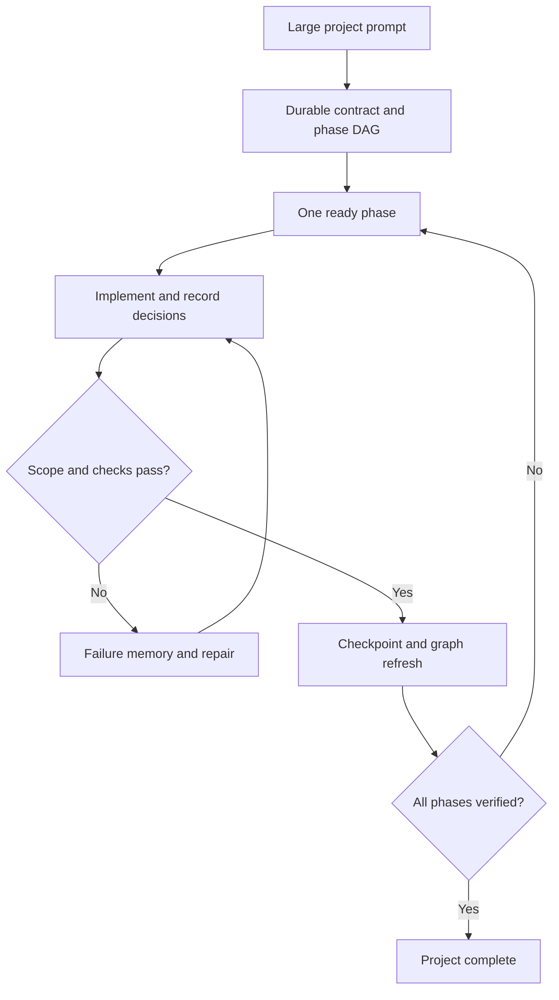

# Keep Coding

Keep Coding turns one large software-project prompt into a durable, evidence-gated implementation loop. It has one default workflow—no user-facing modes and no dashboard to maintain.

It supports two surfaces:

- **Codex plugin:** skill, lifecycle hooks, local stdio MCP server, and automatic context restoration.
- **ChatGPT custom app:** opt-in remote MCP endpoint with bounded repository tools for normal ChatGPT chats.

Both surfaces share the same SQLite project ledger, phase state machine, verification gates, failure memory, and lightweight file/symbol/import graph.

## Why it exists

Long agent runs often fail through drift: requirements disappear, phase boundaries blur, failed approaches repeat, and “done” becomes a narrative claim. Keep Coding stores the contract outside the chat and advances a phase only when its file scope and acceptance commands pass.

## Default workflow



## Requirements

- Node.js 22.13 or newer
- Git repository for every target project
- Codex with plugin support for the Codex surface
- An eligible ChatGPT workspace and remotely reachable MCP endpoint for normal ChatGPT

## Install for Codex

```bash
npm ci
npm run check
```

In Codex CLI, open `/plugins`, add this repository as a marketplace, install **Keep Coding**, review and trust its hooks, then start a new session. The committed distributable is `plugins/keep-coding/dist/keep-coding.mjs`.

## Use in normal ChatGPT chats

Run the opt-in Streamable HTTP MCP server:

```bash
export KEEP_CODING_ALLOWED_ROOTS="/home/me/projects"
export KEEP_CODING_ALLOWED_COMMANDS_JSON='["npm run check","npm test","git diff --check"]'
node plugins/keep-coding/dist/keep-coding.mjs mcp-http
```

Then connect the remote `/mcp` endpoint as a custom ChatGPT app. A local stdio server cannot be connected directly; use Secure MCP Tunnel for a developer machine/private network or deploy behind HTTPS and authentication.

The normal-chat integration includes bounded workspace tools, but not Codex lifecycle hooks. See [docs/CHATGPT_APP.md](docs/CHATGPT_APP.md) for eligibility, deployment, security controls, and setup.

## Use

Open a Git repository and give the desired outcome directly:

> Build this production-ready project end to end from the specification. Include the architecture, implementation, tests, documentation, and release configuration.

Keep Coding activates automatically in supported Codex surfaces for project-scale requests. In normal ChatGPT, select or explicitly invoke the custom app.

Durable state is written to `.keep-coding/state.db` in the target repository. Add `.keep-coding/` to the target project's `.gitignore`; Keep Coding excludes it from verification and indexing.

## MCP tools

### Project lifecycle

| Tool | Purpose |
|---|---|
| `initialize_project` | Create the ledger and index the repository. |
| `save_plan` | Store the project contract and acyclic phase graph. |
| `get_context` | Compile bounded, current model context. |
| `start_phase` | Start one dependency-ready phase. |
| `record_decision` | Preserve architectural/product rationale. |
| `record_failure` | Deduplicate failed approaches. |
| `checkpoint_phase` | Enforce scope and run acceptance commands. |
| `get_status` | Read the durable snapshot. |
| `complete_project` | Complete only after every phase passes. |

### Remote workspace

| Tool | Purpose |
|---|---|
| `list_files` | List bounded repository paths. |
| `read_file` | Read a bounded line range from a text file. |
| `search_code` | Search bounded repository text. |
| `get_diff` | Inspect the current bounded Git diff. |
| `apply_patch` | Apply a unified patch only inside an active phase's allowed scope. |

All tools require an explicit absolute `project_root`. HTTP mode canonicalizes it against `KEEP_CODING_ALLOWED_ROOTS`. Remote plans and checkpoints accept only exact commands listed by the server operator.

## Evaluate it statistically

Copy `examples/keep-coding.eval.example.json`, keep everything except plugin availability identical, then run:

```bash
node plugins/keep-coding/dist/keep-coding.mjs eval ./keep-coding.eval.json
```

The evaluator creates paired detached worktrees and writes `raw.jsonl`, `summary.json`, and `summary.md` with success rates, Wilson 95% intervals, paired delta, and exact McNemar p-value. See [docs/EVALUATION.md](docs/EVALUATION.md).

## Development

```bash
npm ci
npm run check
```

The pipeline runs ESLint, strict TypeScript, tests with coverage gates, a production bundle, and plugin structure validation. See [docs/ARCHITECTURE.md](docs/ARCHITECTURE.md), [SECURITY.md](SECURITY.md), and [docs/README.tr.md](docs/README.tr.md).

## Status

The product keeps one default evidence-gated workflow. The repository graph is structural, not language-server-grade semantic analysis. ChatGPT custom-app availability and write permissions depend on the current OpenAI plan/workspace rollout.

## License

MIT
