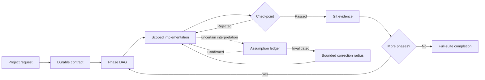

<div align="center">

# 🧭 Keep Coding

### Make coding agents finish what they start.

Durable project memory, scoped execution, semantic code intelligence,
and evidence-gated completion for long-running coding agents.

[](https://github.com/brutalstein/keep-coding-plugin/actions/workflows/ci.yml)
[](https://github.com/brutalstein/keep-coding-plugin/actions/workflows/keep-coding.yml)


[Quick Start](#-quick-start) ·
[How It Works](#-how-it-works) ·
[Connect an Agent](#-connect-an-agent) ·
[Documentation](#-documentation)

</div>

---

> **Long-running agents should keep coding — not keep forgetting.**

Keep Coding is a local-first control plane for coding agents.

It turns a large project request into a durable contract, a dependency-aware phase plan, scoped implementation work, verifiable checkpoints, and a final full-suite completion gate.

It does not replace your coding agent. It gives the agent structure, memory, boundaries, and proof.

## Why Keep Coding?

Coding agents are useful, but long tasks expose predictable failure modes:

| Common failure                           | Keep Coding response                |
| ---------------------------------------- | ----------------------------------- |
| The agent forgets earlier decisions      | Durable SQLite project memory       |
| Work drifts beyond the requested scope   | Phase-scoped file boundaries        |
| “Done” is claimed without proof          | Evidence-backed verification gates  |
| One change breaks distant code           | Semantic impact analysis            |
| A wrong assumption causes a full rewrite | Bounded correction blast radius     |
| Every turn repeats the whole context     | Sequence-aware delta context        |
| Integration depends on one vendor        | Shared MCP and Agent Skills backend |

The result is a workflow that is easier to inspect, resume, verify, and trust.

## 🔄 How It Works



A phase is completed only after its configured gates pass:

```text
Scope
  → Secret scan
  → Budget
  → Impacted tests
  → Acceptance commands
  → Required approvals
  → Correction boundaries
  → Optional critic
  → Git checkpoint
```

No passing evidence, no completed phase.

## ⚡ Quick Start

### Requirements

* Node.js `22.13` or newer
* Git
* A trusted local clone of this repository

### Install and build

```bash
git clone https://github.com/brutalstein/keep-coding-plugin.git
cd keep-coding-plugin

npm ci
npm run build
```

Run the complete verification pipeline:

```bash
npm run check
```

### Start a project

Create a prompt file describing the project:

```markdown
Build a small API with authentication.

Requirements:
- Use TypeScript.
- Add unit and integration tests.
- Do not change the public API without approval.
- The project is complete when all tests and lint checks pass.
```

Initialize Keep Coding:

```bash
node plugins/keep-coding/dist/keep-coding.mjs \
  init /absolute/path/to/project < project-prompt.md
```

Inspect the project:

```bash
node plugins/keep-coding/dist/keep-coding.mjs \
  status /absolute/path/to/project
```

Open the local dashboard:

```bash
node plugins/keep-coding/dist/keep-coding.mjs \
  dashboard /absolute/path/to/project
```

The dashboard binds to `127.0.0.1` by default.

## 🤖 Connect an Agent

Keep Coding exposes one canonical backend through several integration layers.

| Host                | Recommended integration                                 |
| ------------------- | ------------------------------------------------------- |
| Codex               | Packaged plugin, skill, MCP server, and lifecycle hooks |
| Claude Code         | Claude plugin or project-scoped stdio MCP               |
| Cursor              | Stdio or Streamable HTTP MCP                            |
| Windsurf            | Stdio or Streamable HTTP MCP                            |
| VS Code MCP clients | Stdio or Streamable HTTP MCP                            |
| Gemini CLI          | Generic MCP configuration                               |
| OpenCode            | Generic MCP configuration                               |
| Hosts without hooks | Sequence-aware `poll` command                           |

Every integration uses the same executable and durable state model.

### Generic stdio MCP

```json
{
  "mcpServers": {
    "keep_coding": {
      "command": "node",
      "args": [
        "/absolute/path/to/keep-coding-plugin/plugins/keep-coding/dist/keep-coding.mjs",
        "mcp"
      ]
    }
  }
}
```

Target repositories are passed explicitly through each MCP tool's `project_root`.

### Claude Code

```bash
claude mcp add \
  --scope project \
  --transport stdio \
  keep_coding -- \
  node /absolute/path/to/plugins/keep-coding/dist/keep-coding.mjs mcp
```

The bundled plugin can also be loaded directly:

```bash
claude --plugin-dir ./plugins/keep-coding
```

### Hookless clients

Clients without lifecycle hooks can request only the durable state that changed after a known sequence:

```bash
node plugins/keep-coding/dist/keep-coding.mjs \
  poll /absolute/path/to/project 42
```

An unchanged project returns a compact unchanged response instead of retransmitting the full context.

<details>
<summary><strong>Streamable HTTP setup</strong></summary>

Start the bounded HTTP transport with explicit roots and authentication:

```bash
KEEP_CODING_ALLOWED_ROOTS=/absolute/path/to/project \
KEEP_CODING_BEARER_TOKEN=replace-with-a-secret \
node plugins/keep-coding/dist/keep-coding.mjs mcp-http
```

Keep the default loopback binding unless an authenticated reverse proxy and TLS boundary already exist.

The built-in bearer-token check is not an OAuth provider.

See [`docs/INSTALL_MCP.md`](docs/INSTALL_MCP.md) for the complete setup.

</details>

## ✨ Core Capabilities

### Durable execution

* Stores project contracts, phases, decisions, failures, evidence, and approvals
* Builds dependency-aware phase DAGs
* Supports adaptive phase insertion and supersession
* Preserves completed evidence during plan amendments
* Upgrades existing v0.1–v0.3 SQLite state additively
* Recovers interrupted serial and parallel checkpoints through a leased, replayable SQLite saga journal
* Recovers interrupted serial and parallel checkpoints through a leased, replayable SQLite saga journal

### Scoped implementation

* Restricts writes to the active phase scope
* Confines remote workspace access to canonical project roots
* Creates atomic Git evidence for passing phases
* Supports isolated worktrees for parallel-safe phases
* Reopens previously completed phases when impact analysis requires reverification

### Evidence-gated completion

* Runs impacted tests before broader suites
* Executes explicit acceptance commands
* Enforces token, cost, and wall-clock budgets
* Supports human approval gates
* Supports an optional independent critic
* Rejects project completion while active or stale phases remain

### Efficient context

* Sends only context sections changed after the last sequence
* Suppresses repeated unchanged hook payloads
* Provides small Tier-0 graph summaries
* Expands exact graph regions only when requested
* Returns indexed file digests before full file reads
* Compresses repeated command failures and noisy logs

### Durable assumptions and bounded correction

When an interpretation is uncertain, the agent records it before implementation.

An assumption can be linked to exact:

* files,
* symbols,
* decisions,
* and dependent graph nodes.

When an assumption is wrong, Keep Coding does not treat “sorry, starting over” as a recovery plan.

It computes a bounded correction radius and restricts repair work to the intersection of:

1. the original phase scope, and
2. the computed or explicitly justified correction scope.

Low-confidence assumptions and highly ambiguous phases cannot silently pass checkpoints.

## 🧠 Semantic Code Intelligence

Keep Coding builds a semantic dependency graph for impact analysis, selective testing, and correction boundaries.

| Language   | Parser                                       |
| ---------- | -------------------------------------------- |
| TypeScript | TypeScript compiler AST                      |
| JavaScript | TypeScript compiler AST                      |
| Python     | Hash-verified `web-tree-sitter` WASM grammar |
| C          | Hash-verified `web-tree-sitter` WASM grammar |
| C++        | Hash-verified `web-tree-sitter` WASM grammar |

The graph can represent:

* files and test files,
* symbols,
* imports,
* lexical calls,
* references,
* containment,
* test relationships,
* phase ownership,
* assumptions,
* and header/source symbol equivalence.

C and C++ declarations and definitions can be joined through explainable `same_symbol` edges.

### Safe parser degradation

Every parser grammar and query is checked against committed SHA-256 and byte-count metadata.

A missing, corrupted, or incompatible parser asset cannot silently become trusted graph data.

Keep Coding records degraded-mode telemetry and falls back to the bounded legacy parser.

### Current semantic boundary

Tree-sitter provides reliable local syntax and lexical structure. It is not a full compiler.

The following remain explicit Tier-2 capabilities:

* cross-module Python type resolution,
* macro expansion,
* conditional preprocessing,
* C++ overload resolution,
* template instantiation,
* and compiler-authoritative symbol binding.

Pyright or clangd integration is intentionally deferred until real evaluation evidence justifies the additional subprocess and configuration boundary.

## 📊 Quality Snapshot

| Metric                          |              v0.4.0 |
| ------------------------------- | ------------------: |
| Source tests                    |     **149 passing** |
| Source test files               |              **39** |
| Compiled distribution scenarios |       **5 passing** |
| Statement coverage              |          **84.32%** |
| Branch coverage                 |          **75.05%** |
| Enforced branch floor           |             **75%** |
| Function coverage               |          **88.13%** |
| Line coverage                   |          **89.56%** |
| Executable size                 | **1,309,988 bytes** |
| Verified parser sidecars        | **4,721,428 bytes** |

Verified source suite: 149 tests across 39 files.

The complete check command runs:

```text
Lint
  → Strict TypeScript
  → Source coverage
  → Coverage delta report
  → Production build
  → Byte-identical bundle check
  → Compiled distribution tests
  → Context benchmark
  → Graph benchmark
  → Parser asset verification
  → Evaluation corpus verification
  → Cross-agent distribution verification
  → Documentation drift check
  → Executable plugin validation
```

```bash
npm run check
```

## 🧪 Evaluation Without Marketing Math

The repository includes a frozen 24-task paired evaluation corpus covering:

* greenfield development,
* refactoring,
* Python,
* C,
* and C++ tasks.

The evaluation runner uses:

* detached Git worktrees,
* frozen starting commits,
* external verifier contracts,
* counterbalanced paired runs,
* configurable repetitions,
* Wilson confidence intervals,
* and exact McNemar comparisons.

Keep Coding does **not** publish invented efficacy percentages.

Real baseline-versus-treatment claims require an available external agent, repeated authenticated runs, and independent verifier execution.

See [`docs/EVALUATION_RESULTS.md`](docs/EVALUATION_RESULTS.md) for the current evidence state.

## 🛠️ CLI Reference

```bash
# Create durable project state from a prompt
keep-coding init /path/to/repo < project-prompt.md

# Show current project and phase status
keep-coding status /path/to/repo

# Read compact durable context
keep-coding context /path/to/repo

# Read changes after the last delivered sequence
keep-coding poll /path/to/repo <last-sequence>

# Calculate semantic impact
keep-coding impact /path/to/repo src/core/service.ts

# Start the local read-only dashboard
keep-coding dashboard /path/to/repo

# Generate a PR description from durable evidence
keep-coding pr-description /path/to/repo

# Run the frozen paired evaluation corpus
keep-coding eval-corpus ./keep-coding.corpus.eval.json
```

During local development, replace `keep-coding` with:

```bash
node plugins/keep-coding/dist/keep-coding.mjs
```

## 🗂️ Project Structure

```text
keep-coding-plugin/
├── assets/tree-sitter/          # Verified grammar and query sources
├── evaluation/corpus/           # Frozen paired-evaluation corpus
├── examples/                    # MCP and evaluator examples
├── plugins/keep-coding/         # Packaged agent integrations
│   ├── dist/                    # Executable and parser sidecars
│   ├── hooks/                   # Lifecycle adapters
│   └── skills/                  # Packaged Agent Skill
├── skills/keep-coding/          # Canonical Agent Skills package
├── src/
│   ├── core/                    # Planning, graph, verification, workspace
│   ├── eval/                    # Corpus and paired evaluation runner
│   ├── hooks/                   # Host lifecycle handling
│   ├── mcp/                     # Stdio and Streamable HTTP MCP
│   └── storage/                 # SQLite migrations and persistence
├── tests/                       # Source and integration tests
└── scripts/                     # Build and verification gates
```

## 🔐 Security

Keep Coding can expose code-reading and code-editing tools to an agent host.

Use it with the same care as any privileged development tool:

* Keep allowed roots narrow.
* Use trusted local clones or verified release artifacts.
* Preserve command allowlists.
* Keep HTTP on loopback unless a proper TLS and authentication boundary exists.
* Treat repository content as untrusted input.
* Protect `.keep-coding/state.db`.
* Protect the opt-in global playbook database.
* Review agent-generated acceptance commands.

Read [`SECURITY.md`](SECURITY.md) before exposing the HTTP transport.

## 📚 Documentation

| Document                                                   | Purpose                                           |
| ---------------------------------------------------------- | ------------------------------------------------- |
| [`docs/INSTALL_MCP.md`](docs/INSTALL_MCP.md)               | Host-agnostic MCP installation                    |
| [`docs/ARCHITECTURE.md`](docs/ARCHITECTURE.md)             | Components, state, graph, and verification design |
| [`docs/EVALUATION.md`](docs/EVALUATION.md)                 | Evaluation methodology                            |
| [`docs/EVALUATION_RESULTS.md`](docs/EVALUATION_RESULTS.md) | Current evidence and result boundary              |
| [`SECURITY.md`](SECURITY.md)                               | Security model and deployment boundaries          |
| [`docs/README.tr.md`](docs/README.tr.md)                   | Türkçe dokümantasyon                              |
| [`CHANGELOG.md`](CHANGELOG.md)                             | Release history                                   |

## Contributing

Before opening a pull request:

```bash
npm ci
npm run check
```

A change should not weaken:

* project-root confinement,
* phase scope enforcement,
* verification gates,
* parser integrity,
* durable-state migration compatibility,
* or compiled distribution reproducibility.

Small changes with strong evidence are preferred over large changes with weak explanations.

---

<div align="center">

### Build boldly. Verify calmly. Keep coding. 🧭

</div>
